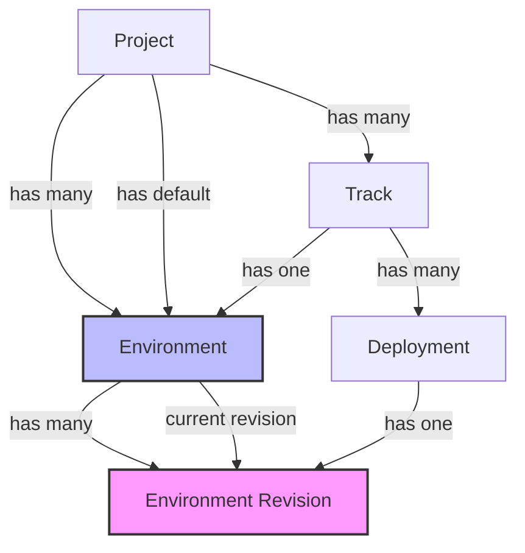
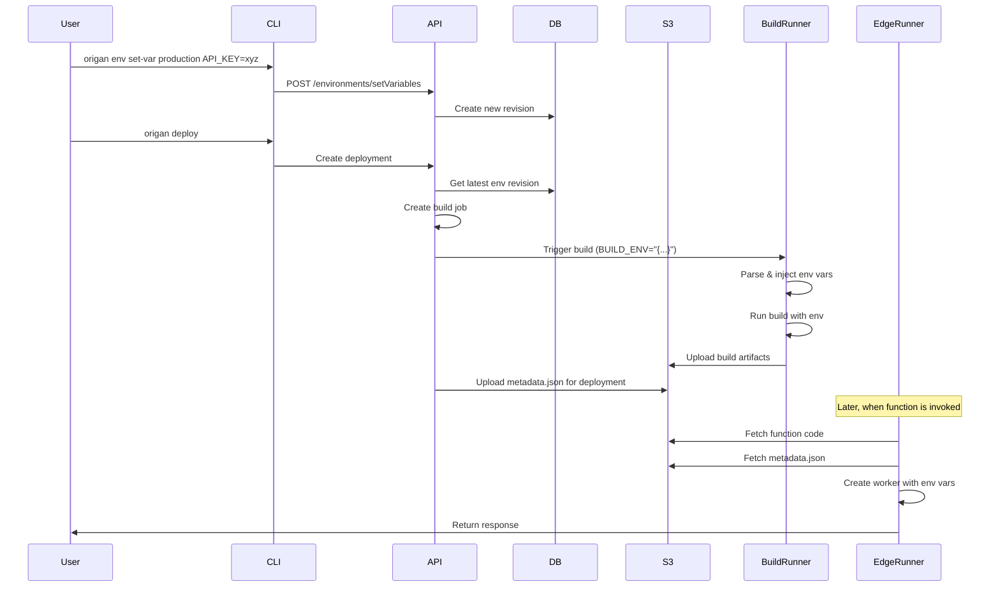

# RFD 001: Environment Variables - Management API and Runtime Distribution

## Summary

This RFD proposes a two-part implementation for environment variables in Origan:

1. **Management Layer**: API and data model for storing and versioning environment variables
2. **Distribution Layer**: Mechanisms for distributing variables to build runners and edge runtime

The design allows users to manage environment variables scoped per environment, with these variables being available at build time (for remote builds) and runtime (for edge functions).

*What's not included in this RFD is the management by the user of the environments themselves (creating/deleting) or a system to encrypt secrets. This will be handled in a future RFD.*

## Implementation Overview

The implementation is split into two distinct parts:

### Part 1: Management API
- Database schema for environments and revisions
- API for variable management  
- CLI commands for user interaction

### Part 2: Runtime Distribution
- Build runner integration via environment variables
- Edge runner integration via S3/MinIO storage

## Product overview

- User should be able to define environment variables for the production deployments
- User should be able to define environment variables for the branch previews and the non prod-deployments
- Environment variables should be used at build time (for frontend remote builds) and at runtime (for edge execution)

- (future) User should be able to create additional environments
- (future) User should be able to define secrets in the environment variables

## Part 1: Management API

### 1.1 Core Concepts

We introduce two new core concepts: **Environment** and **Environment Revision**.

**Environment Name Constraints:**
- Names must be unique per project
- Allowed characters: lowercase letters, numbers, and hyphens (a-z, 0-9, -)
- Must start with a letter
- Examples: `production`, `staging`, `preview`, `dev-team-1`

An environment is made of multiple revisions that represent the state of the environment variables at a given point in time. The revisions are immutable, and any edition of the environment will create a new revision.

Tracks may reference an environment, so that new deployment in the track can be linked to the latest revision of the environment.

We propose that an environment is set as default so that deployments in tracks without environment or deployments without tracks will use the default environment (Note: this RFD works with or without track-free deployments, which are still controversial).

#### Relationship Diagram



This diagram shows:
- Each project has multiple environments and tracks
- Environments contain multiple immutable revisions
- Tracks can reference an environment
- Deployments capture a specific revision, ensuring consistency

### 1.2 Data Model

#### New Environment Models (Drizzle)

```typescript
// New table: environments
export const environmentsSchema = pgTable("environments", {
  id: uuid("id").primaryKey().defaultRandom(),
  projectId: uuid("project_id")
    .notNull()
    .references(() => projectSchema.id, { onDelete: "cascade" }),
  name: text("name").notNull(), // Must be unique per project, alphanumeric + hyphens only
  isSystem: boolean("is_system").notNull().default(false),
  isDefault: boolean("is_default").notNull().default(false),
  ...timestamps,
}, (table) => ({
  projectNameIdx: uniqueIndex("project_name_idx").on(table.projectId, table.name),
}));

// New table: environment_revisions  
export const environmentRevisionsSchema = pgTable("environment_revisions", {
  id: uuid("id").primaryKey().defaultRandom(),
  environmentId: uuid("environment_id")
    .notNull()
    .references(() => environmentsSchema.id, { onDelete: "cascade" }),
  revisionNumber: integer("revision_number").notNull(),
  variables: jsonb("variables").notNull().default({}),
  createdBy: uuid("created_by").references(() => userSchema.id),
  ...timestamps,
}, (table) => ({
  envRevisionIdx: uniqueIndex("env_revision_idx").on(
    table.environmentId, 
    table.revisionNumber
  ),
}));
```

#### Changes to Existing Models

```typescript
// Update tracks table
export const trackSchema = pgTable("track", {
  // ... existing fields ...
  
  // Add environment reference
  environmentId: uuid("environment_id")
    .references(() => environmentsSchema.id),
});

// Update deployments table
export const deploymentSchema = pgTable("deployment", {
  // ... existing fields ...
  
  // Add environment revision reference
  environmentRevisionId: uuid("environment_revision_id")
    .references(() => environmentRevisionsSchema.id),
});
```

### 1.3 Default Environment Setup

When a new project is created, two environments are automatically provisioned:

#### Production Environment
- **Name**: `production`
- **Purpose**: Used for production deployments
- **Configuration**:
  - `is_system`: true (cannot be deleted)
  - `is_default`: false
  - Automatically linked to the existing production track (production track will use this env as environment_id)

#### Preview Environment
- **Name**: `preview`
- **Purpose**: Used for branch previews and development deployments
- **Configuration**:
  - `is_system`: true (cannot be deleted)
  - `is_default`: true (used when no environment is specified)
  - Not linked to any track by default

This setup ensures:
- Production deployments have isolated variables
- Preview/development deployments share a common environment
- Users have working environments immediately without configuration

### 1.4 API Design

#### Environment Actions

```typescript
// List environments by project
POST /api/environments/listByProjectReference
{
  projectReference: string;
}

// Get environment variables by name
POST /api/environments/getVariablesByName
{
  projectReference: string;
  name: string;
}

// Set environment variables
POST /api/environments/setVariables
{
  projectReference: string;
  name: string;
  variables: Array<{
    key: string;
    value: string;
  }>;
}
```

### 1.5 CLI Integration

#### New Commands

```bash
# Environment management
origan env list                               # List all environments for current project
origan env set-var <name> KEY=value          # Set environment variable (e.g., production, preview)
origan env get-vars <name>                   # List environment variables
origan env unset-var <name> KEY              # Remove environment variable
```

Examples:
```bash
# Set a production API key
origan env set-var production API_KEY=prod-key-123

# Set a preview database URL
origan env set-var preview DATABASE_URL=postgres://preview-db

# View all variables in production
origan env get-vars production

# Remove a variable from preview
origan env unset-var preview DEBUG_MODE
```

## Part 2: Runtime Distribution

### 2.1 Distribution Overview

Environment variables need to be distributed to two different execution contexts:
- **Build Runner**: For compile-time configuration of the frontend
- **Edge Runner**: For runtime configuration in serverless functions execution

Both systems receive variables without direct database access, maintaining security and decoupling.

### 2.2 Build Runner Integration

Environment variables will be injected into the build process through the existing environment variable mechanism:

```typescript
// Addition to BuildRunnerEnvSchema in build-runner/src/config.ts
export const BuildRunnerEnvSchema = z.object({
  // ... existing fields ...
  
  // Environment variables for the build
  BUILD_ENV: z.string().optional(), // JSON string of environment variables
});
```

When the control API triggers a build:
1. Fetch the environment revision's variables
2. Serialize as JSON and pass via `BUILD_ENV`
3. Build runner parses and injects into process.env when building the frontend

```typescript
// In build-runner/src/index.ts
if (config.BUILD_ENV) {
  try {
    const envVars = JSON.parse(config.BUILD_ENV);
    Object.assign(process.env, envVars);
    await logger.info(`Injected ${Object.keys(envVars).length} environment variables`);
  } catch (error) {
    await logger.error(`Failed to parse BUILD_ENV: ${error}`);
  }
}
```

### 2.3 Edge Runner Integration

The edge runner needs access to environment variables without connecting to the database or API. We'll use S3/MinIO to store and fetch environment variables:

```typescript
// Deployment structure in S3:
// deployments/{deploymentId}/metadata.json - Deployment metadata at root
// deployments/{deploymentId}/app/* - User application code in app subdirectory

const metadataPath = `deployments/${deploymentId}/metadata.json`;
```

**Storage approach:**
- Environment variables are stored in metadata.json alongside the deployment code
- The edge runner fetches metadata.json from S3 when needed
- Files are written to local filesystem following the same structure as function code
- The existing cleanup process removes stale directories after 30 minutes of inactivity

**Deployment Flow:**
1. When creating a deployment, the control API:
   - Fetches the environment revision's variables
   - Uploads them to S3 as `metadata.json` alongside the deployment bundle
   - Stores variables with deployment metadata

2. Edge runner modification:
```typescript
// In runner/functions/supervisor/index.ts
// Fetch deployment metadata including environment variables
const metadataPath = `deployments/${deploymentId}/metadata.json`;
const localMetadataPath = `${workerPath}/metadata.json`;

let deploymentEnvVars = {};

try {
  // Fetch metadata from S3
  const metadataContent = await getObject(envVarsObj.BUCKET_NAME, metadataPath);
  const metadata = JSON.parse(metadataContent);
  deploymentEnvVars = metadata.environmentVariables;
  
  // Write to local filesystem
  await Deno.writeTextFile(localMetadataPath, metadataContent);
  
  // Merge with system env vars, deployment vars take precedence
  const workerEnvVars = {
    ...envVarsObj,
    ...deploymentEnvVars,
  };
  
  // Pass to worker (note: user code is in app subdirectory)
  const worker = new Worker(`${workerPath}/app/index.ts`, {
    type: "module",
    deno: {
      permissions: { /* ... */ },
      env: workerEnvVars, // Use merged environment
    },
  });
} catch (error) {
  console.warn(`No metadata found for deployment: ${error}`);
  // Continue with system env vars only
}
```

**Implementation Note:** As part of this RFD implementation, we need to update:
1. The deployment service (`uploadToS3` function) to upload user code under the `app/` subdirectory instead of directly under `deployments/${deploymentId}/`
2. The edge runner to fetch user code from `deployments/${deploymentId}/app/*` paths and cache them locally under `${workerPath}/app/`

This structural change ensures that metadata.json (stored at the deployment root) never conflicts with user code.

### 2.4 Storage Format

Deployment metadata in S3 will be stored as JSON:
```json
{
  "deploymentId": "uuid",
  "projectId": "uuid",
  "environmentRevisionId": "uuid",
  "createdAt": "2024-01-01T00:00:00Z",
  "environmentVariables": {
    "API_KEY": "value",
    "DATABASE_URL": "value",
    "DEBUG": "true"
  }
}
```

### 2.5 Complete Flow Example



This approach ensures:
- Consistent environment variables across build and runtime
- No direct database access from edge runners

## Future Optimizations

- distributed caching: Currently, each edge runner maintains its own local cache of environment variables. Future optimizations could include a shared cache mechanism (e.g., Redis) to reduce redundant fetches and improve performance.
- secrets management: how to handle sensitive values securely, possibly integrating with a secrets management service or using encrypted storage.
- Allow a user to create additional environments targeting specific tracks and manage them through the CLI and API.
- Sanitize env variables and prevent some keys from being set? For example: `PATH`, `HOME`, `DENO_*`, `ORIGAN_*`, or other system/runtime variables - This would need more work and can be handled in a future work.
